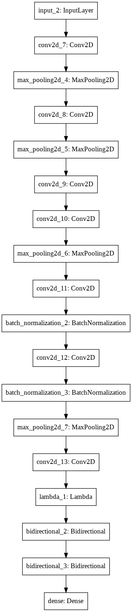
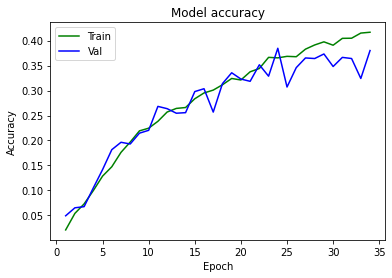

# handwritten-text-recognition
Handwritten Text Recognition using IAM Dataset in Tensorflow 2.0

The model has been trained on a small subset of IAM dataset with only 10000 images. The images are preprocessed and text is encoded before feeding into the model. The project makes use of teacher-student model architecture. This implementation includes the use of Embedding Layer and BiLSTM layer.

## Model Architecture - Training

## Model Architecture - Validation

At the end of 33 epochs, the trained model reports an accuracy of 42% on the training data and an accuracy of 38% on the validation data.

Here are some predictions from the trained model

As you may observe, in some cases the model is performing exceptionally well and in some cases, the performance is just repulsive.
